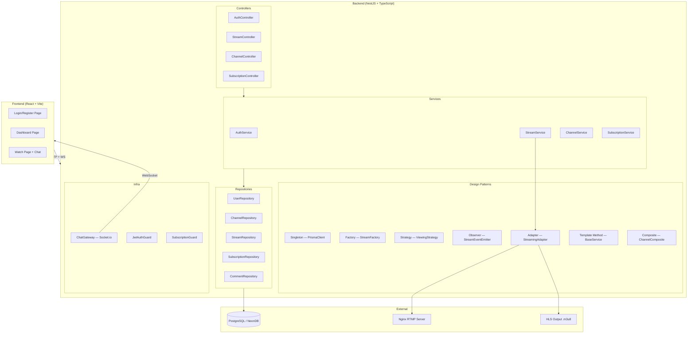

# 🎬 Live Streaming Platform MVP — Implementation Plan

## Overview

Build a production-grade MVP for a live streaming platform with RTMP ingestion (OBS → Nginx RTMP → HLS) and real-time chat. The backend is the primary focus (80%) using NestJS + TypeScript with strict layered architecture and GoF design patterns. The frontend is a minimal React JSX app.

---

## Architecture Diagram



---

## Proposed Folder Structure

```
SDSE Project/
├── server/                          # Backend (NestJS + TypeScript)
│   ├── .env
│   ├── .gitignore
│   ├── package.json
│   ├── tsconfig.json
│   ├── nest-cli.json
│   ├── nginx/
│   │   └── nginx.conf               # RTMP + HLS Nginx config
│   ├── prisma/
│   │   └── schema.prisma
│   └── src/
│       ├── main.ts                   # Bootstrap
│       ├── app.module.ts             # Root module
│       │
│       ├── common/                   # Shared utilities
│       │   ├── database/
│       │   │   └── prisma.service.ts          # Singleton pattern
│       │   │   └── prisma.module.ts
│       │   ├── base/
│       │   │   └── base.service.ts            # Template Method pattern
│       │   │   └── base.repository.ts
│       │   ├── guards/
│       │   │   ├── jwt-auth.guard.ts
│       │   │   └── subscription.guard.ts
│       │   ├── decorators/
│       │   │   └── current-user.decorator.ts
│       │   ├── interfaces/
│       │   │   └── index.ts
│       │   └── middleware/
│       │       └── logger.middleware.ts
│       │
│       ├── modules/
│       │   ├── auth/
│       │   │   ├── auth.module.ts
│       │   │   ├── auth.controller.ts
│       │   │   ├── auth.service.ts
│       │   │   ├── dto/
│       │   │   │   ├── register.dto.ts
│       │   │   │   └── login.dto.ts
│       │   │   └── strategies/
│       │   │       └── jwt.strategy.ts
│       │   │
│       │   ├── user/
│       │   │   ├── user.module.ts
│       │   │   ├── user.service.ts
│       │   │   └── user.repository.ts
│       │   │
│       │   ├── channel/
│       │   │   ├── channel.module.ts
│       │   │   ├── channel.controller.ts
│       │   │   ├── channel.service.ts
│       │   │   ├── channel.repository.ts
│       │   │   └── channel.composite.ts        # Composite pattern
│       │   │
│       │   ├── stream/
│       │   │   ├── stream.module.ts
│       │   │   ├── stream.controller.ts
│       │   │   ├── stream.service.ts
│       │   │   ├── stream.repository.ts
│       │   │   ├── stream.factory.ts           # Factory pattern
│       │   │   ├── stream.observer.ts          # Observer pattern
│       │   │   └── dto/
│       │   │       ├── create-stream.dto.ts
│       │   │       └── update-stream.dto.ts
│       │   │
│       │   ├── subscription/
│       │   │   ├── subscription.module.ts
│       │   │   ├── subscription.controller.ts
│       │   │   ├── subscription.service.ts
│       │   │   ├── subscription.repository.ts
│       │   │   └── strategies/
│       │   │       ├── viewing-strategy.interface.ts  # Strategy pattern
│       │   │       ├── free-viewing.strategy.ts
│       │   │       └── paid-viewing.strategy.ts
│       │   │
│       │   ├── chat/
│       │   │   ├── chat.module.ts
│       │   │   ├── chat.gateway.ts             # WebSocket gateway
│       │   │   └── chat.service.ts
│       │   │
│       │   └── streaming/
│       │       ├── streaming.module.ts
│       │       ├── streaming.adapter.ts         # Adapter pattern
│       │       └── streaming.service.ts
│       │
│       └── config/
│           └── jwt.config.ts
│
├── frontend/                        # React + Vite (JSX)
│   ├── src/
│   │   ├── main.jsx
│   │   ├── App.jsx
│   │   ├── App.css
│   │   ├── pages/
│   │   │   ├── LoginPage.jsx
│   │   │   ├── RegisterPage.jsx
│   │   │   ├── DashboardPage.jsx
│   │   │   └── WatchPage.jsx
│   │   ├── components/
│   │   │   ├── VideoPlayer.jsx
│   │   │   ├── ChatBox.jsx
│   │   │   └── Navbar.jsx
│   │   └── services/
│   │       └── api.js
│   └── ...existing config files
│
└── README.md
```

---

## Proposed Changes

### Component 1: Prisma Schema & Database

#### [NEW] [schema.prisma](file:///Users/Narendra/Desktop/NST/NST-Notes/Sem%204%20NST%20&%20Rishihood/SDSE%20Project/server/prisma/schema.prisma)

Models: `User`, `Channel`, `Stream`, `Subscription`, `Comment`

Key design decisions:
- **1:1 User ↔ Channel** — enforced with `@unique` on `userId`
- **Unique `streamKey`** on Channel for OBS ingestion lookup
- **Indexes** on `channelId`, `streamId`, `isLive` for query performance
- **Subscription** tracks `plan` (FREE/PAID) and `expiresAt`
- **Comment** is linked to both stream and user for chat history

---

### Component 2: Common / Shared Layer

#### [NEW] `prisma.service.ts` — **Singleton Pattern**
- Wraps PrismaClient as a NestJS injectable
- Implements `OnModuleInit` for connection lifecycle
- Single instance across entire app

#### [NEW] `base.service.ts` — **Template Method Pattern**
- Abstract class with `findAll()`, `findById()`, `create()`, `update()`, `delete()`
- Subclasses override hooks (`beforeCreate`, `afterCreate`, etc.)
- Enforces consistent CRUD flow across all modules

#### [NEW] `base.repository.ts`
- Generic repository abstraction for Prisma models

#### [NEW] `jwt-auth.guard.ts` — JWT authentication guard
#### [NEW] `subscription.guard.ts` — Subscription enforcement guard
#### [NEW] `current-user.decorator.ts` — Extract user from JWT
#### [NEW] `logger.middleware.ts` — Request logging

---

### Component 3: Auth Module

#### [NEW] `auth.controller.ts`
- `POST /auth/register` — register user + auto-create channel + generate streamKey
- `POST /auth/login` — validate credentials, return JWT

#### [NEW] `auth.service.ts`
- Password hashing with bcrypt
- JWT token generation
- Delegates to UserService and ChannelService

#### [NEW] `jwt.strategy.ts` — Passport JWT strategy for token validation
#### [NEW] DTOs: `register.dto.ts`, `login.dto.ts`

---

### Component 4: Channel Module

#### [NEW] `channel.composite.ts` — **Composite Pattern**
- Models the hierarchy: Channel → Streams → Comments
- `ChannelComponent` interface with `getDetails()` method
- `ChannelComposite` aggregates streams, each stream aggregates comments

#### [NEW] `channel.controller.ts`
- `GET /channels/:id` — get channel with full composite hierarchy
- `GET /channels/me` — get current user's channel

#### [NEW] `channel.service.ts` — extends BaseService
#### [NEW] `channel.repository.ts`

---

### Component 5: Stream Module

#### [NEW] `stream.factory.ts` — **Factory Pattern**
- `StreamFactory.create(type, data)` — creates stream entries with default config
- Encapsulates stream creation logic, generates thumbnails path, sets defaults

#### [NEW] `stream.observer.ts` — **Observer Pattern**
- `StreamEventEmitter` extends NestJS EventEmitter
- Events: `stream.started`, `stream.ended`
- Listeners: notify chat gateway, update channel status

#### [NEW] `stream.controller.ts`
- `POST /streams` — create stream (uses Factory)
- `PATCH /streams/:id/start` — go live (emits Observer event)
- `PATCH /streams/:id/stop` — end stream
- `GET /streams/live` — list all live streams
- `GET /streams/channel/:channelId` — streams by channel

#### [NEW] `stream.service.ts` — extends BaseService
#### [NEW] `stream.repository.ts`
#### [NEW] DTOs: `create-stream.dto.ts`, `update-stream.dto.ts`

---

### Component 6: Subscription Module — **Strategy Pattern**

#### [NEW] `viewing-strategy.interface.ts`
```typescript
interface ViewingStrategy {
  canWatch(user: User, stream: Stream): ViewingResult;
  getMaxDuration(): number | null; // null = unlimited
}
```

#### [NEW] `free-viewing.strategy.ts`
- Returns max 5 minutes (300 seconds)

#### [NEW] `paid-viewing.strategy.ts`
- Returns unlimited duration

#### [NEW] `subscription.controller.ts`
- `POST /subscriptions/subscribe` — upgrade to paid
- `GET /subscriptions/status` — check current plan

#### [NEW] `subscription.service.ts`
- Selects strategy based on user's subscription status

---

### Component 7: Chat Module

#### [NEW] `chat.gateway.ts` — WebSocket Gateway (Socket.io)
- Namespace: `/chat`
- Events: `joinRoom(streamId)`, `sendMessage`, `newMessage`
- Room-based: one room per streamId
- Persists messages as Comments in DB

#### [NEW] `chat.service.ts`
- Save/retrieve chat messages
- Delegates to Comment repository

---

### Component 8: Streaming Adapter — **Adapter Pattern**

#### [NEW] `streaming.adapter.ts`
- Unified interface: `IStreamingService`
- Methods: `getIngestUrl(streamKey)`, `getPlaybackUrl(streamKey)`, `validateStreamKey(key)`
- Wraps RTMP ingest URL generation and HLS playback URL construction
- Decouples business logic from RTMP/HLS specifics

#### [NEW] `streaming.service.ts`
- Uses adapter to provide streaming URLs to controllers

---

### Component 9: Nginx RTMP Config

#### [NEW] `nginx/nginx.conf`
- RTMP server block on port 1935
- `on_publish` callback to validate streamKey via backend API
- HLS output to `/tmp/hls/` with `.m3u8` playlist
- HTTP server block to serve HLS files

---

### Component 10: Frontend (Minimal React JSX)

#### [MODIFY] `App.jsx` — Add routing with react-router-dom
#### [NEW] `pages/LoginPage.jsx` — Simple login form
#### [NEW] `pages/RegisterPage.jsx` — Registration form with channelName
#### [NEW] `pages/DashboardPage.jsx` — Show channel info, streamKey, "Go Live" button
#### [NEW] `pages/WatchPage.jsx` — HLS video player + chat box
#### [NEW] `components/VideoPlayer.jsx` — HLS.js player
#### [NEW] `components/ChatBox.jsx` — Socket.io chat
#### [NEW] `components/Navbar.jsx` — Simple navigation
#### [NEW] `services/api.js` — Axios/fetch wrapper for API calls

---

## Design Patterns Summary

| Pattern | Location | Purpose |
|---------|----------|---------|
| **Singleton** | `prisma.service.ts` | Single DB connection instance |
| **Factory** | `stream.factory.ts` | Encapsulate stream creation logic |
| **Strategy** | `subscription/strategies/` | Free (5 min) vs Paid (unlimited) viewing |
| **Observer** | `stream.observer.ts` | Broadcast stream lifecycle events |
| **Adapter** | `streaming.adapter.ts` | Wrap RTMP/HLS service interface |
| **Template Method** | `base.service.ts` | Common CRUD flow with hooks |
| **Composite** | `channel.composite.ts` | Channel → Streams → Comments tree |

---

## User Review Required

> [!IMPORTANT]
> **Database**: Using the NeonDB PostgreSQL connection string from your `.env`. Prisma will run migrations against this.

> [!IMPORTANT]
> **NestJS**: The backend will use NestJS framework with full TypeScript. This requires initializing a new NestJS project in `server/`. The existing `.env` and `.gitignore` will be preserved.

> [!WARNING]
> **Nginx RTMP**: The config file will be provided but Nginx with RTMP module must be installed separately on your machine. The backend will work without it (API-only mode) but actual OBS streaming requires Nginx RTMP.

> [!NOTE]
> **Frontend**: Will use your existing Vite + React setup. Need to add `react-router-dom`, `hls.js`, `socket.io-client`, and `axios` as dependencies. Frontend is JSX only (no TypeScript).

---

## Open Questions

1. **JWT Secret**: Should I generate a random JWT secret for the `.env` or do you have a preferred one?
2. **Subscription Duration**: For the paid plan, what should the default subscription duration be? (e.g., 30 days)
3. **Port Config**: Default backend port `3001` and frontend on `5173` — acceptable?

---

## Verification Plan

### Automated Tests
- `npx prisma validate` — validate schema
- `npx prisma generate` — generate client
- `npm run build` — ensure TypeScript compiles cleanly
- Test auth endpoints via curl/browser
- Test WebSocket chat connection

### Manual Verification
- Register a user → verify channel + streamKey created
- Login → verify JWT returned
- Create stream → go live → verify stream listed
- Watch page → HLS player loads
- Chat → messages appear in real-time
- Free user → verify 5-minute limit logic
- Subscribe → verify unlimited access

### Browser Testing
- Navigate to frontend, test register/login flow
- Dashboard shows channel info and stream key
- Watch page renders video player and chat
